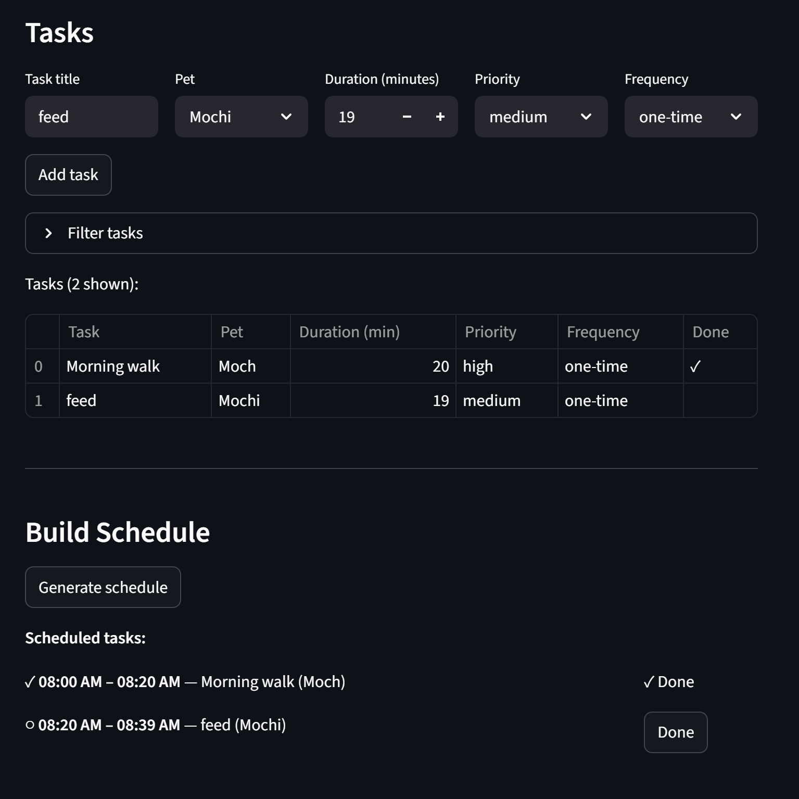

# PawPal+ (Module 2 Project)

You are building **PawPal+**, a Streamlit app that helps a pet owner plan care tasks for their pet.

## Scenario

A busy pet owner needs help staying consistent with pet care. They want an assistant that can:

- Track pet care tasks (walks, feeding, meds, enrichment, grooming, etc.)
- Consider constraints (time available, priority, owner preferences)
- Produce a daily plan and explain why it chose that plan

Your job is to design the system first (UML), then implement the logic in Python, then connect it to the Streamlit UI.

## What you will build

Your final app should:

- Let a user enter basic owner + pet info
- Let a user add/edit tasks (duration + priority at minimum)
- Generate a daily schedule/plan based on constraints and priorities
- Display the plan clearly (and ideally explain the reasoning)
- Include tests for the most important scheduling behaviors

## Smarter Scheduling

`pawpal_system.py` includes several scheduling features beyond a basic task list:

- **Priority-based scheduling** — tasks are sorted by priority (1 = high) before being placed into the owner's available time window. Shorter tasks break ties to maximize the number of tasks that fit.
- **Conflict detection** — `DailyPlan.detect_conflicts()` checks all scheduled tasks for overlapping time windows and returns a list of warning messages without crashing the program.
- **Recurring tasks** — tasks can be marked `"daily"` or `"weekly"`. Calling `DailyPlan.mark_task_complete(task)` marks the task done and automatically appends a new instance with the next due date (calculated with `timedelta`) to the plan.
- **Filtering and sorting** — `filter_tasks(completed=..., pet_name=...)` narrows the task list by status or pet; `sort_by_time()` returns scheduled tasks in chronological order.

## Demo



The screenshot shows two tasks added for Mochi — a high-priority morning walk and a medium-priority feed. After clicking **Generate schedule**, both tasks are placed in chronological order within the owner's available window, with Done buttons to mark each complete.

## Getting started

### Setup

```bash
python -m venv .venv
source .venv/bin/activate  # Windows: .venv\Scripts\activate
pip install -r requirements.txt
```

### Suggested workflow

1. Read the scenario carefully and identify requirements and edge cases.
2. Draft a UML diagram (classes, attributes, methods, relationships).
3. Convert UML into Python class stubs (no logic yet).
4. Implement scheduling logic in small increments.
5. Add tests to verify key behaviors.
6. Connect your logic to the Streamlit UI in `app.py`.
7. Refine UML so it matches what you actually built.
